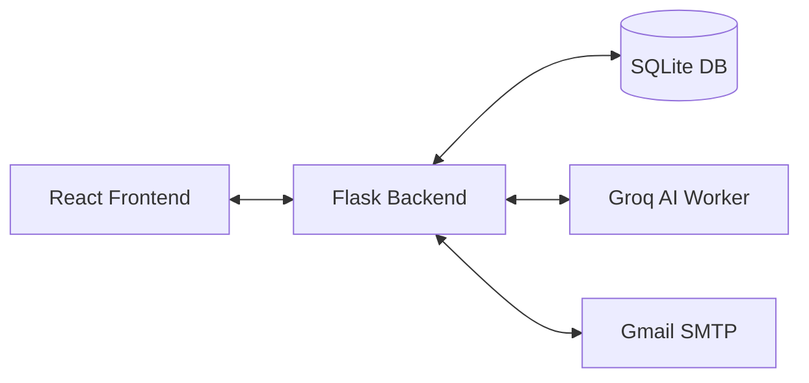

# Outreach Tool 🚀

A powerful, local-first personal email outreach tool that generates unique, human-sounding personalized emails using the Groq API and sends them via Gmail SMTP with automated resume attachments.

**Single-user • Localhost-only • Privacy-focused**

---

## ✨ Key Features

- **Parallel Email Generation**: Leverages multi-threading (`ThreadPoolExecutor`) to generate multiple personalized drafts simultaneously, significantly reducing wait times.
- **Multi-Key Round-Robin**: Supports up to 3 Groq API keys. The system intelligently cycles through keys in a round-robin fashion to multiply effective rate limits and throughput.
- **Live Progress Tracking**: Real-time visual feedback via a dedicated progress bar UI. Monitor successes, failures, and individual error messages as they happen.
- **Gmail SMTP Integration**: Securely send emails using Gmail App Passwords. Supports automated resume attachments (PDF) and threaded follow-ups.
- **Intelligent Personalization**: Powered by Groq's high-speed inference (Llama 3), tailoring every email to the lead's profile and your custom campaign goal.
- **Lightweight CRM**: Manage leads, track campaign status, and handle threaded follow-ups from a unified dashboard.
- **Local-First Privacy**: Your leads, email drafts, and API keys are stored locally in a SQLite database and an encrypted config file.

---

## 🛠️ Tech Stack

- **Backend**: Python 3.11+, Flask (REST API), SQLite (Database), APScheduler.
- **Frontend**: React 18, Vite, Tailwind CSS v3, React Router v6.
- **AI Inference**: Groq SDK (Llama 3 70B/8B).
- **Automation**: Multi-threaded generation workers.

---

## 📋 Prerequisites

- **Python**: 3.11 or higher.
- **Node.js**: 18.x or higher.
- **Gmail Account**: Must have [2-Step Verification](https://myaccount.google.com/security) enabled.
- **Groq API Key**: At least one key from the [Groq Console](https://console.groq.com/keys). (Up to 3 recommended for high-volume tasks).

---

## 🚀 Getting Started

### 1. Clone the Repository
```bash
git clone https://github.com/your-username/outreach-tool.git
cd outreach-tool
```

### 2. Backend Setup
```bash
cd backend
python -m venv venv
# Windows:
.\venv\Scripts\activate
# Linux/macOS:
source venv/bin/activate

pip install -r requirements.txt
python app.py
```
*The server will start on `http://localhost:5000`.*

### 3. Frontend Setup
```bash
cd ../frontend
npm install
npm run dev
```
*The application will be available at `http://localhost:5173`.*

---

## ⚙️ Configuration

No manual file editing is required. All configuration is handled through the application UI:

1.  **Profile Page**: Fill in your personal details (Name, College, Skills, Bio) and upload your Resume (PDF). Don't forget to parse your resume. This data is used by the AI to personalize your outreach mails.
2.  **Settings Page**:
    - **Gmail**: Enter your Gmail address and **App Password** (see below).
    - **API Keys**: Add up to 3 Groq API keys to enable parallel generation and rate-limit scaling. Use temporary mail services like [SmailPro](https://smailpro.com/temporary-email) to generate fake emails and register them on Groq to get API keys. Try using VPN if your IP gets banned by Groq.
    - **Delay**: Configure the send delay (default 60s) to comply with Gmail's sending limits.

### 🔑 Getting a Gmail App Password
1.  Go to [Google Account Security](https://myaccount.google.com/security).
2.  Navigate to **2-Step Verification** > **App Passwords**.
3.  Generate a new app password for "Mail".
4.  Copy the 16-character code into the Settings page.

---

## 🏗️ Architecture Overview

### Data Flow


- **Frontend**: A SPA built with React that polls the backend for real-time progress updates during generation.
- **Backend**: A Flask application that manages a thread pool for parallel AI requests.
- **Database**: SQLite stores all lead information, campaign history, and email templates.
- **In-Memory Progress**: Generation status is tracked in real-time, allowing the UI to show instant feedback.

---

## 🤝 Contributing

Contributions are welcome! Please feel free to submit a Pull Request or open an issue for bugs and feature requests.

## 📄 License

This project is licensed under the MIT License.
